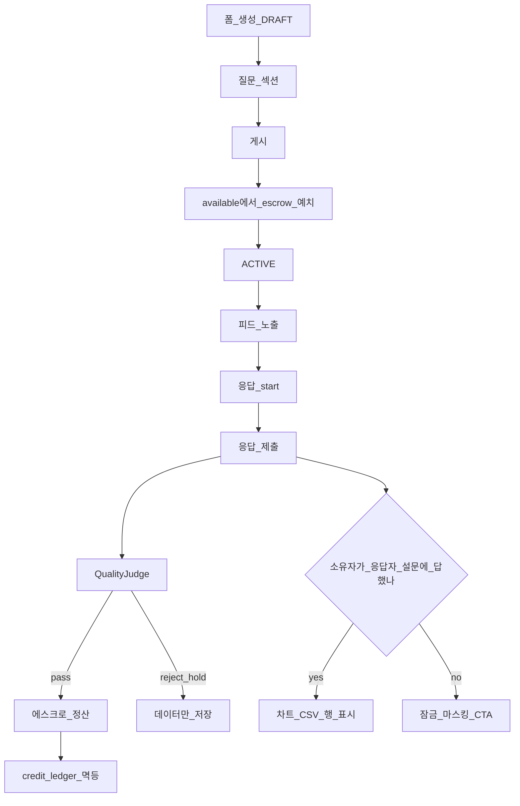
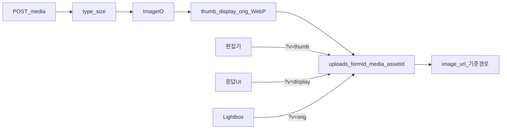

# 품앗이폼 (PumasiForm)

> **상대가 내 설문에 답해 주면, 그 사람의 설문에 답해야 그 응답을 볼 수 있습니다.**

품앗이폼은 **1:1 상호 응답(품앗이) 언락**과 **크레딧 에스크로 풀**을 결합한 설문 플랫폼입니다.  
설문은 만들기 쉽지만 응답을 모으기는 어렵습니다. 이 프로젝트는 “응답을 공짜로 받는” 전통적 폼 도구 대신, **상대에게 답해야 그 사람의 답을 연다**는 규칙과, **게시 시 크레딧을 예치해 성실 응답자에게 보상**하는 경제를 함께 둡니다.

이 문서는 저장소 루트의 **제품·아키텍처·기능·개발 과정에서 겪은 문제와 해결**을 한곳에 모아 설명합니다.  
실행 절차의 세부는 하위 README를 보세요.

| 문서 | 내용 |
|------|------|
| [pumasi-egov/README.md](pumasi-egov/README.md) | 백엔드 실행, curl E2E, eGov 계층, 설계 결정 요약 |
| [pumasi-web/README.md](pumasi-web/README.md) | 프론트 화면, 환경 변수, 데모 시나리오 |
| [품앗이폼_요구사항_명세서.md](품앗이폼_요구사항_명세서.md) | 제품 요구사항 |
| [품앗이폼_마스터_설계문서_v2.md](품앗이폼_마스터_설계문서_v2.md) | 마스터 설계(D1–D7 등) |

---

## 목차

1. [왜 만들었는가](#1-왜-만들었는가)
2. [핵심 규칙 (반드시 이해할 것)](#2-핵심-규칙-반드시-이해할-것)
3. [저장소 구조](#3-저장소-구조)
4. [기술 스택](#4-기술-스택)
5. [기능 카탈로그](#5-기능-카탈로그)
6. [아키텍처와 데이터 흐름](#6-아키텍처와-데이터-흐름)
7. [API와 화면 맵](#7-api와-화면-맵)
8. [데이터베이스 (Flyway V1–V12)](#8-데이터베이스-flyway-v1v12)
9. [설계 결정 요약](#9-설계-결정-요약)
10. [개발 과정에서 겪은 문제와 해결](#10-개발-과정에서-겪은-문제와-해결)
11. [로컬에서 실행하기](#11-로컬에서-실행하기)
12. [테스트와 검증](#12-테스트와-검증)
13. [범위 밖 · 후속 과제](#13-범위-밖--후속-과제)
14. [문서 인덱스](#14-문서-인덱스)
15. [데모 계정](#15-데모-계정)

---

## 1. 왜 만들었는가

### 1.1 문제

논문·스타트업·마케팅 설문은 **구글폼·네이버폼**으로 쉽게 만들 수 있습니다.  
하지만 응답을 모으는 비용은 그대로입니다.

- 지인에게만 돌리면 표본이 편향됩니다.
- 유료 패널은 비싸거나 품질이 들쭉날쭉합니다.
- “설문 품앗이”(네가 내 것 답하면 나도 네 것 답한다)는 오프라인·단톡방에서 이미 일어나지만, **플랫폼이 그 약속을 강제하지 않습니다.**

### 1.2 제품 한 줄

**품앗이폼 = (상호 응답으로 결과를 여는 게이트) + (게시 시 예치·성실 응답에 보상하는 크레딧 풀)**

두 축은 서로 다른 일을 합니다.

| 축 | 역할 | 열쇠 |
|----|------|------|
| **1:1 상호 언락** | 개별 응답·집계를 “볼 수 있게” 만듦 | 상대의 설문에 **내가** 응답했는지 |
| **크레딧 에스크로** | 설문을 **게시**하고 응답자를 **모을** 연료 | 게시 시 `cost × maxResponses` 예치 |

결과 행을 여는 열쇠는 **크레딧이 아닙니다.**  
크레딧은 노출·보상 풀을 돌리는 데 쓰입니다.

### 1.3 현재 구현의 성격

이 저장소의 실행 가능한 본체는 **walking skeleton**입니다.

- **동작하는 수직 슬라이스:** 폼 생성 → 게시(에스크로) → 응답 → 품질 판정·정산 → 상호 언락된 결과/차트/CSV → 피드·공유·SEO·문항 이미지
- **설계 폴더의 야망:** 이벤트 파이프라인, 하이브리드 랭킹 전체, PG 결제, 비동기 Excel 등 — 문서·TDD 산출물로 남아 있으며 **전부 egov에 배선된 것은 아님**

README와 코드를 읽을 때 **“구현된 스켈레톤”**과 **“설계서에만 있는 미래”**를 구분하는 것이 중요합니다.

---

## 2. 핵심 규칙 (반드시 이해할 것)

### 2.1 상호 응답 언락

1. **A**가 **B**의 설문에 응답한다.
2. **B**가 그 응답(및 집계에 그 응답을 포함)을 보려면, **A**가 소유한 설문 중 하나에 **B**가 응답해야 한다.
3. 차트·CSV·개별 행은 **잠금이 풀린 pass 응답**만 집계·표시한다.
4. 상대가 **ACTIVE** 설문이 없으면 행은 잠긴 채로 남고, UI는 “상대가 게시 중인 설문이 없다”고 안내한다.

구현 위치(요약):

- SQL: `pumasi-egov/.../result/Result_SQL.xml` (`selectPassAnswersUnlocked`, `selectUnlockedRespondentIds`, `selectUnlockTarget` 등)
- 서비스: `ResultServiceImpl` — 잠긴 행 마스킹, 차트는 unlocked pass만
- UI: `pumasi-web/app/forms/[id]/results/page.tsx`, `GateBlur` 등

### 2.2 크레딧 에스크로

1. 게시 시 제작자의 `available`에서 `cost × maxResponses`를 **escrow**로 옮긴다.
2. 응답이 **pass**로 판정되면: 제작자 escrow에서 `cost` 차감, 응답자에게 `reward`(대략 80%), 나머지는 `SYSTEM`으로 burn.
3. **reject/hold**여도 응답 데이터는 저장한다. 크레딧만 미지급(또는 정책에 따름).
4. 마감·정원 도달 시 미소진 escrow는 환불한다.
5. 원장 `credit_ledger(reason, ref_id)` UNIQUE로 **이중 정산·이중 환불을 막는다.**

### 2.3 품질과 집계

- **유효성(답변 검증)**과 **어뷰징(속도·패턴)**은 분리한다.
- 클라이언트 제출 소요시간은 신뢰하지 않는다. `POST .../responses/start`로 서버가 세션을 열고 제출 시 경과를 계산한다.
- 결과 집계의 “pass” 위에 **상호 언락**이 한 겹 더 있다. (pass여도 잠겨 있으면 차트에 안 들어감)

### 2.4 FAQ와 동일한 메시지

랜딩 FAQ([`pumasi-web/lib/faq.ts`](pumasi-web/lib/faq.ts))와 가이드([`pumasi-web/lib/guide.ts`](pumasi-web/lib/guide.ts))의 카피는 위 규칙을 그대로 반영합니다.  
제품 카피와 코드가 어긋나면 **코드가 아니라 카피를 고치거나**, 의도적으로 규칙을 바꾼 뒤 카피·가이드·온보딩을 함께 고쳐야 합니다.

---

## 3. 저장소 구조

```
pumasi/
├── pumasi-egov/          # Spring Boot + eGov + MyBatis + Flyway + PostgreSQL (API)
├── pumasi-web/           # Next.js 14 App Router (UI)
├── .tools/               # 로컬용 Temurin JDK 21, Gradle 8.10.2 (제품 코드 아님)
├── README.md             # ← 이 문서
├── 품앗이폼_*.md         # 요구사항·마스터 설계·백엔드/전환 설계 등
├── 품앗이 마스터 설계/   # 설계 문서 복제·가드레일 등
└── (각종 *_TDD / zip)    # 과거 순수 로직 TDD·실험 산출물
```

| 경로 | 역할 |
|------|------|
| **pumasi-egov** | 실제로 빌드·실행되는 백엔드 walking skeleton |
| **pumasi-web** | 빌더·피드·응답·결과·랜딩·가이드 |
| **.tools** | CI/로컬에서 JDK·Gradle 경로를 고정하기 위한 번들 |
| **루트 설계 md** | 제품·모듈 설계의 정본에 가까운 문서 |
| **TDD 폴더** | 이벤트·피드 매칭·비동기 export 등 — 참고용, egov와 1:1 대응 아님 |

패키지(백엔드) 개요:

```
egovframework.pmsi
├── auth          # 로그인·세션(Bearer)
├── cmm           # 예외, AuthInterceptor, 보안 헤더, @CurrentUser
├── config        # MyBatis, CORS, 인터셉터
├── form          # 폼·섹션·질문·피드·공개·media·files
├── credit        # 잔액·에스크로·원장·SettlementCalc
├── response      # 시작/제출·QualityJudge·AnswerValidator
└── result        # 언락·집계·CSV·차트 KPI
```

패턴: 서비스 인터페이스 + `*ServiceImpl extends EgovAbstractServiceImpl`,  
검증·판정·정산·집계는 **프레임워크 없는 순수 Java**로 분리해 단위 테스트합니다.

---

## 4. 기술 스택

### 4.1 백엔드 (`pumasi-egov`)

| 항목 | 선택 |
|------|------|
| 언어 / 런타임 | Java 21 |
| 프레임워크 | Spring Boot 3.3.x |
| 공공·표준 | 전자정부표준프레임워크 rte 4.3 (`EgovAbstractServiceImpl`, `EgovAbstractMapper`) |
| 영속화 | MyBatis 3.5 + mybatis-spring |
| 마이그레이션 | Flyway |
| DB | PostgreSQL 16 (`docker-compose.yml`) |
| 이미지 | Thumbnailator + `com.github.usefulness:webp-imageio` (WebP, aarch64 포함) |
| 포트 | 8080 |
| 업로드 | `pmsi.upload.dir` (기본 `./uploads`) |

### 4.2 프론트엔드 (`pumasi-web`)

| 항목 | 선택 |
|------|------|
| 프레임워크 | Next.js 14 (App Router), React 18, TypeScript |
| 스타일 | Tailwind CSS |
| 서버 상태 | @tanstack/react-query |
| 차트 | recharts |
| 폰트 | Outfit + Noto Sans KR |
| 환경 | `NEXT_PUBLIC_API_BASE`, `NEXT_PUBLIC_SITE_URL` |

### 4.3 왜 eGov + Spring Boot인가

공공·엔터프라이즈 맥락에서 **표준 계층·이름 기반 DI·매퍼 XML**을 유지하면서도,  
로컬 개발 속도는 Spring Boot로 확보하는 하이브리드입니다.  
비즈니스 핵심(비용·정산·품질·집계·언락)은 순수 클래스로 빼 두어 **프레임워크 교체 비용**을 줄였습니다.

---

## 5. 기능 카탈로그

### 5.1 폼 작성기

- 폼 생성·수정, 최대 응답 수, 마감 시각(`closes_at`)
- 섹션, 질문 순서 변경
- 질문 유형(응답형 8종): `SHORT_TEXT`, `LONG_TEXT`, `RADIO`, `CHECKBOX`, `DROPDOWN`, `LINEAR_SCALE`, `RATING`, `DATE` + 콘텐츠 블록 `DESCRIPTION`, `IMAGE` + 첨부 `FILE`
- RADIO **주의 문항**(`attentionAnswer`) — 지정 답과 다르면 제출 즉시 reject
- RADIO 조건부 분기(`branch_rules` JSON) — 뒤 섹션으로만
- 게시 시 비용 자동 산정(대략 문항당 1분, 장문 2분, 최소 1크레딧) 후 escrow 예치
- 공유 토큰(`share_token`) — **소유자에게만** API로 노출

화면: [`pumasi-web/app/forms/new/page.tsx`](pumasi-web/app/forms/new/page.tsx),  
편집기: [`QuestionEditor.tsx`](pumasi-web/components/QuestionEditor.tsx)

### 5.2 문항 이미지 (media 파이프라인)

IMAGE 유형과 일반 문항의 “문항 이미지(선택)”는 URL 텍스트가 아니라 **업로드**입니다.

- `POST /pmsi/form/{formId}/media` — 소유자, DRAFT/ACTIVE, 최대 8MB (jpeg/png/webp/gif)
- 서버가 **thumb / display / orig** WebP 파생본 생성 (긴 변 상한 480 / 1280 / 2400)
- DB `image_url`에는 기준 경로만: `/pmsi/form/{formId}/media/{assetId}`
- 클라이언트는 `?v=thumb|display|orig`로 선택
- `GET` media는 **인증 불필요**(공유 미리보기·``용). 에셋 ID는 UUID
- 응답 화면: [`QuestionImage.tsx`](pumasi-web/components/QuestionImage.tsx) — srcset + 라이트박스

응답 **FILE 첨부**(`/files`)와는 별도입니다. FILE은 PDF 등 원본 저장용이고, 문항 삽화는 `/media`만 사용합니다.

### 5.3 응답

- `POST .../responses/start` → 제출 시 서버 elapsed
- 유형별 입력 ([`AnswerInput.tsx`](pumasi-web/components/AnswerInput.tsx)), 섹션 진행, 동의 필수
- 품질: pass / hold / reject (`QualityJudge` + 주의 문항 채점)
- hold 응답은 소유자가 결과 화면에서 **승인**(소급 정산, 멱등)/**거절**
- reject 급증 시 **가드레일**이 폼을 자동 PAUSED → 소유자가 재개
- view/start/submit **퍼널 이벤트** 기록(`survey_event`) → 결과 화면 완료율 지표
- 폼당 사용자 1응답 (UNIQUE)
- 익명 라벨, 본인 설문 응답 금지

화면: [`/forms/[id]/respond`](pumasi-web/app/forms/[id]/respond/page.tsx)

### 5.4 결과 · 차트 · CSV

- 소유자만 결과 API
- KPI: 전체/pass/hold/reject, unlocked 수, 언락률 등
- 차트: choice / scale(빈 bin 포함) / text 빈도 / FILE 목록; 체크박스는 합이 100%를 넘을 수 있음 안내
- 개별 행: 잠긴 응답은 블러·CTA(상대 ACTIVE 설문으로 이동)
- CSV: UTF-8 BOM, 잠긴 행 답변 칸 비움, 유일 헤더, 한글 `filename*`
- 대용량은 **비동기 export**: `export_job` 생성 → @Async 워커가 CSV를 스토리지에 저장 → 상태 조회·다운로드

화면: [`/forms/[id]/results`](pumasi-web/app/forms/[id]/results/page.tsx)

### 5.5 피드

- ACTIVE인 **남의** 설문, 아직 안 답한 것 + **escrow 잔여가 있는 것만**(빈 풀 제외)
- **내게 응답한 사람의 설문**을 우선(1:1 부스트, CTE로 1회 계산) → 채움률 낮은 순 → 최신순
- `?page&size` 페이지네이션 — 프론트는 "더 보기" 무한 로드

화면: [`/feed`](pumasi-web/app/feed/page.tsx)

### 5.6 공개 공유 · SEO · 가이드

- `/s/[token]` — 로그인 전 미리보기 → 로그인 후 응답
- 랜딩 `/` — SSR 메타, FAQ, WebApplication + FAQPage JSON-LD
- `sitemap` / `robots` / OG·Twitter 이미지
- `/guide` — 규칙·유의사항
- 첫 방문 `OnboardingModal` (`localStorage` 키 `pumasi.onboarding.v1`)

### 5.7 인증 (데모) · 크레딧 충전

- 비밀번호 없는 **계정 선택 로그인** → Bearer 세션. `PMSI_DEMO_AUTH=false`면 차단(프로덕션 필수), 프론트 계정 스위처도 `NEXT_PUBLIC_DEMO_AUTH`로 게이트
- seed: `u-owner`, `u-alice`, `u-bob`, `SYSTEM`
- `/pmsi/**`는 Bearer 필요. 예외: `/pmsi/auth/**`, `/pmsi/public/**`, **GET media**, `/actuator/health`
- 크레딧 충전: 베타용 **Fake 충전 API**(`POST /pmsi/credit/purchase`, 멱등 키) + 배지의 "+충전" 버튼

프로덕션급 소셜 로그인·실PG 결제는 후속 과제입니다.

---

## 6. 아키텍처와 데이터 흐름

### 6.1 게시 → 응답 → 정산 → 언락 결과



### 6.2 문항 이미지 media



### 6.3 계층 역할

| 계층 | 책임 |
|------|------|
| Controller | HTTP, 소유권·상태 검사, DTO |
| ServiceImpl | 트랜잭션, 오케스트레이션 |
| 순수 로직 | `FormValidator`, `SettlementCalc`, `QualityJudge`, `ResultAggregator`, `AnswerValidator` |
| Mapper XML | SQL, 언락 조인, 피드 부스트, FOR UPDATE |
| Flyway | 스키마·무결성·시드 |

---

## 7. API와 화면 맵

### 7.1 REST (`/pmsi`)

| Prefix | Controller | 설명 |
|--------|------------|------|
| `/pmsi/auth` | `EgovAuthController` | login / me / logout (데모 로그인은 `PMSI_DEMO_AUTH` 게이트) |
| `/pmsi/form` | `EgovFormController` | 폼·질문·섹션·게시·마감·재개(resume) |
| `/pmsi/form/{id}/responses` | `EgovResponseController` | start + submit + HOLD review(pass 소급 정산/reject) |
| `/pmsi/form/{id}/results` | `EgovResultController` | 차트·행·CSV (상호 언락분만) |
| `/pmsi/form/{id}/results/export-jobs` | `EgovExportJobController` | 비동기 대용량 CSV export |
| `/pmsi/form/{id}/media` | `EgovMediaController` | 문항 이미지 (StorageClient 경유) |
| `/pmsi/form/{id}/files` | `EgovFileController` | 응답 파일 첨부 (StorageClient 경유) |
| `/pmsi/feed` | `EgovFeedController` | 상호 부스트·채움률 정렬 피드 (`?page&size`) |
| `/pmsi/credit` | `EgovCreditController` | `/me` 잔액 + `/purchase` Fake 충전 |
| `/pmsi/events` | `EgovEventController` | 퍼널 이벤트 수집 + `/pmsi/form/{id}/events/funnel` 집계 |
| `/pmsi/public/forms` | `EgovPublicFormController` | shareToken 미리보기 |
| `/actuator/health` | Spring Actuator | 헬스체크 (liveness/readiness) |

### 7.2 프론트 라우트

| 경로 | 설명 |
|------|------|
| `/` | 마케팅 랜딩 (SEO/AEO) |
| `/guide` | 이용 안내 |
| `/home` | 내 설문 대시보드 |
| `/forms/new` | 빌더 (`?formId=`로 이어쓰기) |
| `/feed` | 응답 피드 |
| `/forms/[id]/respond` | 응답 |
| `/forms/[id]/results` | 결과 |
| `/s/[token]` | 공개 미리보기 |

---

## 8. 데이터베이스 (Flyway V1–V12)

경로: [`pumasi-egov/src/main/resources/db/migration/`](pumasi-egov/src/main/resources/db/migration/)

| 버전 | 내용 |
|------|------|
| **V1** | form / section / question / option |
| **V2** | credit_balance, credit_ledger, seed |
| **V3** | survey_response / answer, quality_flag |
| **V4** | anon_label, consent (프라이버시) |
| **V5** | user_account, auth_session |
| **V6** | response_session (서버 측정 시간) |
| **V7** | closes_at |
| **V8** | body_html, image_url |
| **V9** | branch_rules, share_token |
| **V10** | 무결성 강화: FK, CHECK, SYSTEM 유저, 인덱스, ledger GENESIS 백필 |
| **V11** | image_url 에셋 규약 주석 (`?v=thumb\|display\|orig`) |
| **V12** | attention_answer(주의 문항), form PAUSED(가드레일), survey_event(퍼널), export_job(비동기 export), 응답자 인덱스 |

**실제 스키마는 V12까지**입니다.

---

## 9. 설계 결정 요약

| ID | 결정 | 요지 |
|----|------|------|
| **D4** | 시간 기반 비용 | 문항 소요시간 근사로 cost 산출. 자가 신고 비용 지양 |
| **D5** | 80/20 + 최소 보상 | `reward = floor(cost×0.8)`, burn = 나머지, cost≥1이면 reward 최소 1 |
| **D6** | 분할 락 | escrow는 `FOR UPDATE`, 적립은 UPSERT, 정원은 폼 행 잠금 |
| **D7** | 게시 시 에스크로 | “결과 열람 유료”가 아니라 “게시·응답 풀 유료” |
| — | Bearer only | `X-User-Id` 헤더 신뢰 폐기 |
| — | 원장 멱등 | `(reason, ref_id)` UNIQUE |
| — | available 불변식 | available에 영향을 주는 reason만 합산; settle 시 `SPEND_ESCROW`를 available 원장에 쓰지 않음 |
| — | 언락 ≠ 크레딧 | 결과 게이트는 상호 응답 |

자세한 배경은 [품앗이폼_마스터_설계문서_v2.md](품앗이폼_마스터_설계문서_v2.md)를 참고하세요.

---

## 10. 개발 과정에서 겪은 문제와 해결

이 섹션은 “문서에만 있던 이상”과 “코드가 실제로 깨지던 지점”을 정리합니다.  
후임자·리뷰어가 **왜 이렇게 짜였는지**를 따라갈 수 있게 하는 것이 목적입니다.

### 10.1 요구사항과 구현의 괴리: 상호 응답 언락

**문제**  
제품 카피·FAQ는 “상대 설문에 답해야 그 응답을 본다”고 했는데, 초기 결과 API는 **소유자에게 모든 pass 응답을 열어 주었습니다.**  
크레딧 풀만 구현되고 **1:1 게이트가 비어 있는** 상태였습니다.

**해결**

1. 언락 정의를 SQL로 고정:  
   “이 폼 소유자가, 해당 응답자가 소유한 **어떤** 폼에든 제출한 이력이 있는가.”
2. 차트·CSV·행 조회가 같은 정의를 쓰도록 `Result_SQL.xml` / `ResultServiceImpl` 정렬.
3. 잠긴 행은 답 비움 + 힌트 + `UnlockTarget`(상대 ACTIVE 설문).
4. 피드에 “내게 답한 사람” 부스트로 교환을 유도.
5. 랜딩·가이드·온보딩 카피를 코드와 맞춤.

**교훈**  
핵심 규칙이 마케팅 문장에만 있으면 버그가 아닙니다. **제품 버그**입니다.  
게이트는 UI 블러만으로는 부족하고, **집계 SQL까지** 같은 규칙을 써야 합니다.

---

### 10.2 DB·원장 무결성 (V10)

**문제**

- FK/CHECK 부재, orphan 가능
- burn 대상 `SYSTEM`이 `user_account`에 없음
- `available = Σ(ledger)` 불변식이 `SPEND_ESCROW` 등으로 깨짐
- `credit_balance.version`이 낙관적 락처럼 보이지만 실제 동시성은 `FOR UPDATE`
- `share_token` 인덱스 중복, 민감 토큰 과다 노출
- 응답 FILE 다운로드 권한이 느슨함

**해결** (`V10__integrity_hardening.sql` + 앱 수정)

- SYSTEM·orphan 백필 후 FK
- status/quality/금액/경과시간 등 CHECK
- anon_label / consent 강화, 핫 인덱스
- GENESIS 백필로 available 정합
- settle 경로에서 available을 깨는 `SPEND_ESCROW` 원장 insert 중단
- SQL에 `available`/`escrow >= amount` 가드
- `shareToken`은 소유자 API에만; public 응답에 재노출 금지
- FILE GET: 소유자 또는 해당 응답자만

**교훈**  
크레딧은 “숫자 두 칸”이 아니라 **원장 불변식**입니다.  
마이그레이션으로 스키마를 조이고, 서비스가 그 불변식을 **다시 깨지 않게** 써야 합니다.

---

### 10.3 CSV 내보내기: 한글 파일명 · CORS · 잠긴 행

**문제**

- 브라우저 다운로드 파일명이 항상 영문 기본값
- 프론트에서 `Content-Disposition`을 읽으려 해도 **CORS에 expose되지 않음**
- 잠긴 응답이 placeholder로 CSV를 오염
- 동일 문항 제목이 헤더 충돌

**해결**

- RFC 5987: `filename="..."; filename*=UTF-8''{urlencoded}`
- `WebConfig`에 `.exposedHeaders("Content-Disposition")`
- 프론트 `filenameFromDisposition` 파싱, 단일 “엑셀용 CSV” 버튼
- 잠긴 행: 열림=N, 답 칸 공란
- 유일 헤더: `제목`, `제목 (2)`, …

관련: `EgovResultController`, `CsvExport`, `ResultServiceImpl`, `ResponsesTable.tsx`

**교훈**  
파일 다운로드 UX는 “서버가 헤더를 잘 보내는 것”과 “브라우저 JS가 그 헤더를 **읽을 수 있게** CORS를 여는 것”이 한 세트입니다.

---

### 10.4 차트 집계 Phase 1

**문제**

- 언락 이전에는 pass 전체가 차트에 들어감
- 선형 배율 빈 구간 누락, 텍스트는 날것 나열, FILE·체크박스 요약 빈약
- API에 KPI summary가 없어 프론트가 제각각 계산

**해결**

- 집계 입력 = unlocked pass only
- `GET .../results` → `{ summary, items }`
- `ResultAggregator`: scale min–max 0채움, text_freq top N, file_list, checkbox 비율 합>100 가능 플래그
- `ResultAggregatorTest`로 순수 로직 고정
- 결과 UI KPI 스트립·섹션 그룹

**교훈**  
집계는 “예쁜 차트”보다 **어떤 표본이 들어가는지**가 제품입니다.  
언락과 품질 플래그를 집계 입구에서 한 번만 거르도록 했습니다.

---

### 10.5 문항 이미지: URL → 업로드 · WebP · 공개 GET

**문제 1 — 제품**  
IMAGE 유형이 URL 텍스트만 받아, 대용량 원본을 그대로 붙이기 쉬운 구조였습니다.

**해결 1**  
`/media` 업로드 + thumb/display/orig 파생본. DB에는 기준 경로만. UI는 srcset·라이트박스.

**문제 2 — WebP on Apple Silicon**  
초기 의존성 `com.github.gotson:webp-imageio:0.2.2`는 jar 안에 **Mac aarch64 네이티브가 없었습니다** (x86_64 Mac·Linux aarch64 등은 있음).  
로컬(M 시리즈)에서 `ImageIO.write(..., "webp", ...)` / Thumbnailator `outputFormat("webp")`가 실패했습니다.

**해결 2**  
`com.github.usefulness:webp-imageio:0.10.2`로 교체 (macos-aarch64 포함).  
`ImageIO.scanForPlugins()` 정적 초기화.  
`ImageAssetServiceTest`로 thumb/display/orig `.webp` 생성 검증.

**문제 3 — 인증과 ``**  
공유 링크·미리보기에서 이미지 GET이 Bearer를 요구하면 ``가 깨집니다.

**해결 3**  
`AuthInterceptor`에서 `GET .../pmsi/form/{id}/media/{assetId}`만 인증 생략.  
POST는 소유자만. 추측 어려운 UUID 에셋 ID.

**문제 4 — multipart 한도**  
JSON용 작은 body 한도와 이미지 8MB가 충돌할 수 있음.  
`application.yml` multipart 8MB / request 10MB, Tomcat form post·swallow 정렬.  
(응답 FILE은 별도 5MB 유지.)

**교훈**  
“동등 WebP ImageIO”라도 **네이티브 아키텍처 매트릭스**를 확인해야 합니다.  
CI가 Linux amd64만이면 로컬 Mac ARM 실패를 놓칩니다 — 단위 테스트로 인코딩 경로를 고정했습니다.

---

### 10.6 인증·권한  hardening

**문제**  
초기 데모가 `X-User-Id`를 믿으면 누구나 위조 가능.

**해결**

- `AuthInterceptor` + Bearer 세션 (`V5`)
- OPTIONS 프리플라이트 통과
- shareToken 비소유자 숨김
- FILE vs media의 **공개 범위가 반대**임을 문서화: media GET public, files GET 제한

---

### 10.7 로컬 툴체인

**문제**  
머신마다 JDK/Gradle 경로가 달라 “내 환경에선 됨”이 반복됨.

**해결**  
저장소 `.tools/`에 Temurin 21 + Gradle 8.10.2를 두고 문서·스크립트에서 그 경로를 사용.  
`JAVA_HOME`이 잘못된 옛 경로를 가리키면 Gradle이 즉시 실패하므로, README·에이전트 모두 **실제 존재하는 디렉터리**를 확인합니다.

---

### 10.8 순수 로직과 eGov의 경계

**문제**  
프레임워크에 붙인 채로는 단위 테스트·TDD가 무겁고, 과거 Maven egress 제약도 있었습니다.

**해결**  
`SettlementCalc`, `QualityJudge`, `FormValidator`, `ResultAggregator`, `AnswerValidator`를 순수 Java로 유지.  
ServiceImpl은 트랜잭션·권한·영속화만 오케스트레이션.

**교훈**  
공공 표준 계층을 지키면서도, **돈이 오고 가는 계산**과 **품질·검증**은 프레임워크 밖으로 빼는 편이 안전합니다.

---

## 11. 로컬에서 실행하기

### 11.1 한눈에

```bash
# 1) DB
cd pumasi-egov
docker compose up -d

# 2) API (JDK 21 + Gradle)
# 예: 저장소 .tools 사용
export JAVA_HOME="$(pwd)/../.tools/jdk-21.0.11+10/Contents/Home"   # 실제 폴더명 확인
export PATH="$(pwd)/../.tools/gradle-8.10.2/bin:$JAVA_HOME/bin:$PATH"
gradle bootRun
# → http://localhost:8080 , Flyway V1–V12 적용

# 3) Web
cd ../pumasi-web
cp .env.local.example .env.local   # NEXT_PUBLIC_API_BASE=http://localhost:8080
npm install
npm run dev
# → http://localhost:3000
```

CORS는 기본적으로 `http://localhost:3000`을 허용합니다.  
포트·도메인을 바꾸면 백엔드 환경 변수 `PMSI_CORS_ORIGINS`(콤마 구분)를 맞추세요.  
프로덕션 배포 시 환경 변수(`PMSI_DEMO_AUTH=false`, `PMSI_STORAGE_MODE=s3` 등)는 [pumasi-egov/README.md](pumasi-egov/README.md)의 표를 보세요.

더 자세한 curl E2E·API 표는 [pumasi-egov/README.md](pumasi-egov/README.md),  
화면별 데모는 [pumasi-web/README.md](pumasi-web/README.md)를 보세요.

### 11.2 빠른 상호 언락 시연

1. `u-owner`로 설문 게시  
2. `u-alice`가 owner 설문에 성실 응답 → pass·크레딧  
3. owner가 results에서 alice 행이 **잠김**인지 확인  
4. `u-alice`가 자기 설문을 게시  
5. `u-owner`가 alice 설문에 응답  
6. owner results에서 alice 행·차트에 반영되는지 확인  

---

## 12. 테스트와 검증

### 12.1 백엔드

```bash
cd pumasi-egov
gradle test
```

대표 테스트:

| 테스트 | 검증 대상 |
|--------|-----------|
| `SettlementCalcTest` | 80/20·최소 보상 |
| `QualityJudgeTest` | pass/hold/reject·주의 문항 |
| `AnswerValidatorTest` | 유형별 답 검증 (DROPDOWN/RATING/DATE 포함) |
| `FormValidatorTest` | 문항 정의 검증·attentionAnswer |
| `ResultAggregatorTest` | scale/text/checkbox/file 집계 |
| `ImageAssetServiceTest` | WebP 파생본 3종 생성 (StorageClient 경유) |
| `CreditSettlementIdempotencyIT` | 원장 멱등(환경 의존 가능) |

CI: [.github/workflows/ci.yml](.github/workflows/ci.yml) — push/PR마다 백엔드 `gradle test` + 프론트 `npm run build`.

### 12.2 프론트

```bash
cd pumasi-web
npm run build
```

타입·린트·페이지 생성까지 통과하는지 확인합니다.

### 12.3 수동 스모크 (이미지)

1. 빌더에서 IMAGE 또는 문항 이미지 업로드 (큰 JPEG)  
2. `uploads/{formId}/media/{assetId}/`에 `thumb.webp`, `display.webp`, `orig.webp` 확인  
3. 응답 화면 네트워크 탭에서 `?v=display` / srcset, 클릭 시 `?v=orig`  

---

## 13. 범위 밖 · 후속 과제

의도적으로 스켈레톤에 넣지 않았거나, 설계만 있는 항목입니다.

| 영역 | 상태 |
|------|------|
| S3 오브젝트 스토리지 | **구현** — `PMSI_STORAGE_MODE=s3` (S3 호환·MinIO 지원). 기본은 로컬 `uploads/`. CDN은 후속 |
| 이미지 크롭 UI / AVIF | 미구현 |
| 응답 FILE 첨부의 WebP 파이프라인 이관 | 후속 (`/files`는 원본 유지) |
| 소셜 로그인 · 실결제 충전 | 데모 로그인은 `PMSI_DEMO_AUTH` 게이트, 충전은 Fake API(멱등). 실인증·실PG는 후속 |
| 이벤트 로깅·완료율 | **구현** — `survey_event` 퍼널(view/start/submit) + 결과 페이지 지표 |
| 가드레일 | **구현** — reject 급증 시 자동 PAUSED + 소유자 재개 |
| 하이브리드 피드 랭킹 전체 | 부분 — 상호 부스트 + 채움률 정렬 + 페이지네이션. 점수식 전체는 후속 |
| 비동기 대용량 export | **구현** — `export_job` + @Async 워커 + 스토리지 저장 CSV. POI xlsx는 후속 |
| SecurityHeadersFilter multipart 예외 | **수정** — `/files`·`/media` POST 모두 256KB 가드 제외(413 해소) |

---

## 14. 문서 인덱스

| 문서 | 설명 |
|------|------|
| [품앗이폼_요구사항_명세서.md](품앗이폼_요구사항_명세서.md) | 제품 요구사항 |
| [품앗이폼_마스터_설계문서.md](품앗이폼_마스터_설계문서.md) | 마스터 설계 |
| [품앗이폼_마스터_설계문서_v2.md](품앗이폼_마스터_설계문서_v2.md) | 마스터 설계 v2 |
| [품앗이폼_백엔드_설계서.md](품앗이폼_백엔드_설계서.md) | 백엔드 설계 |
| [전자정부표준프레임워크_전환_설계서.md](전자정부표준프레임워크_전환_설계서.md) | eGov 전환 |
| [품앗이폼_폼빌더_크레딧_상세기획.md](품앗이폼_폼빌더_크레딧_상세기획.md) | 빌더·크레딧 기획 |
| [품앗이폼_크레딧계수_실험설계.md](품앗이폼_크레딧계수_실험설계.md) | 크레딧 계수 실험 |
| [pumasi-egov/README.md](pumasi-egov/README.md) | 백엔드 실행·API |
| [pumasi-web/README.md](pumasi-web/README.md) | 프론트 실행·화면 |

`품앗이 마스터 설계/` 아래에도 동명·관련 기획이 있습니다. 충돌 시 **루트 최신본과 실행 코드**를 우선하세요.

---

## 15. 데모 계정

| userId | 초기 available (대략) | 용도 |
|--------|----------------------|------|
| `u-owner` | 1000 | 설문 제작·게시·결과 |
| `u-alice` | 50 | 성실 응답·상호 교환 |
| `u-bob` | 50 | 저품질/거절 시나리오 |
| `SYSTEM` | 0 | burn 수신 계정 (로그인 UI 비대상) |

프론트 헤더의 계정 스위처로 로그인하면 `POST /pmsi/auth/login`이 Bearer 토큰을 발급하고, `localStorage`에 보관합니다.

---

## 라이선스 · 기여

이 저장소는 학습·시연용 walking skeleton입니다.  
이슈·PR  orthodoxy보다 **상호 언락 불변식**과 **크레딧 원장 불변식**을 깨지 않는 변경을 우선합니다.

질문이나 규칙이 카피와 어긋나 보이면, 먼저 [§2 핵심 규칙](#2-핵심-규칙-반드시-이해할-것)과 [§10](#10-개발-과정에서-겪은-문제와-해결)을 확인한 뒤 코드를 의심하세요.

---

*문서 버전: 저장소 루트 README — 구현 기준 Flyway V12(주의 문항·가드레일·퍼널 이벤트·비동기 export), StorageClient(local/S3), 질문 유형 8종, 상호 언락 결과/차트/CSV 반영.*
