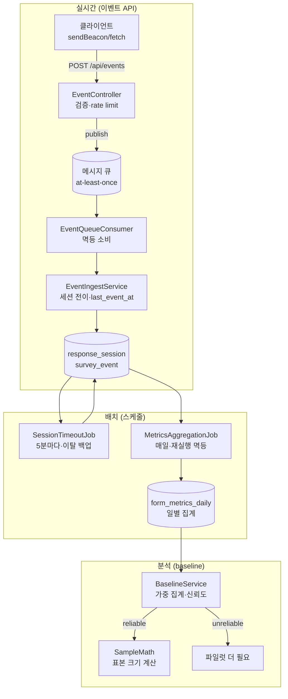

# 품앗이폼 — Java Spring Boot 백엔드 설계서 v1.0

> 백엔드 아키텍처, 모듈 구조, 핵심 기능과 그 구현 상태를 정리한 설계서.
> 범위: 크레딧 트랜잭션, 이벤트 측정 인프라(수신→집계→baseline), 동시성·유실 방지.
> 작성: 시니어 백엔드 관점. 최종 갱신: 2026-06-18

---

## 범례 (구현 상태 표기)

| 표기 | 의미 |
|---|---|
| ✅ **구현+검증** | 코드 작성 완료 + 테스트로 동작 검증(순수 로직은 실제 RED→GREEN 사이클 통과) |
| 🟡 **구현(빌드 미검증)** | Spring 코드 작성 완료, 로직 대조까지 했으나 이 환경에서 컴파일/통합테스트 미실행 |
| 🟦 **테스트 작성됨** | 테스트 코드는 있으나 실 DB/브로커 필요로 로컬·CI 실행 대기 |
| ⬜ **미구현(설계만)** | 설계·방향만 정의, 코드 없음 |

> 환경 제약: 이 작업 컨테이너는 egress 프록시가 Maven Central을 차단(`host_not_allowed`)하여
> Spring/JPA 빌드가 불가능했다. 그래서 **핵심 비즈니스 로직을 프레임워크에서 분리해 순수 Java로
> TDD 검증**하고, Spring 코드는 그 검증된 로직을 감싸는 얇은 어댑터로 작성했다.
> 따라서 "구현+검증 ✅"은 순수 로직 기준이며, Spring 통합은 로컬/CI에서 최종 확인이 필요하다.

---

## 1. 기술 스택

| 레이어 | 선택 | 상태 |
|---|---|---|
| 언어/런타임 | Java 21 | ✅ |
| 프레임워크 | Spring Boot 3.3.x (Web, Data JPA, Validation, Retry) | 🟡 |
| DB | PostgreSQL 16 | 🟡 |
| 캐시 | Redis (피드·세션·rate limit 분산) | ⬜ |
| 메시지 큐 | RabbitMQ 또는 Kafka (이벤트 적재 유실 방지) | 🟡 |
| 마이그레이션 | Flyway | 🟡 |
| 엑셀/CSV | Apache POI / OpenCSV | ⬜ |
| 결제 | 국내 PG(토스페이먼츠/포트원) | ⬜ |
| 빌드 | Gradle | 🟡 |
| 테스트 | JUnit 5 + Testcontainers + Mockito | 🟦 |

---

## 2. 모듈 구조

```
com.pumasiform
├── credit                      크레딧 트랜잭션 (화폐 무결성)
│   ├── CreditBalance           잔액 캐시 엔티티 (@Version 낙관적 락)
│   ├── CreditLedger            append-only 원장 (멱등 유니크 제약)
│   ├── CreditReason            사유 enum + 예외
│   ├── CreditRepositories      비관적 락 메서드 포함
│   └── CreditTransactionService 정산 트랜잭션(예치 차감/적립/소각)
│
└── events                      이벤트 측정 인프라
    ├── EventController          POST /api/events (수신, 검증, rate limit, 큐 발행)
    ├── EventRequest             요청 DTO (Bean Validation)
    ├── GlobalExceptionHandler   검증 실패 → 400
    ├── EventRateLimiter         토큰 버킷 rate limit
    ├── EventIngestService       세션 전이 + last_event_at 갱신 (컨슈머가 호출)
    ├── ResponseSession          세션 엔티티 (전이 메서드 캡슐화)
    ├── SurveyEvent              append-only 이벤트 엔티티
    ├── Repositories             세션/이벤트 리포지토리
    ├── queue                    유실 방지
    │   ├── EventMessage         큐 메시지 (멱등 키)
    │   ├── EventPublisher       퍼블리셔 추상화
    │   └── EventQueueConsumer   컨슈머 (@RabbitListener 예시)
    └── batch                    배치·분석
        ├── MetricsAggregationJob       사전집계 (@Scheduled)
        ├── MetricsAggregationRepository upsert 쿼리
        ├── SessionTimeoutJob           타임아웃 마감 (@Scheduled)
        ├── ResponseSessionTimeoutRepository 조건부 UPDATE
        ├── FormMetricsDaily            일별 집계 엔티티
        ├── FormMetricsQueryRepository  기간 가중집계 쿼리
        ├── MetricsAggregate            집계 프로젝션
        ├── BaselineService             baseline 산출
        └── SampleMath                  표본 크기 공식
```

---

## 3. 측정 인프라 전체 파이프라인



### 파이프라인 단계별 책임

1. **수신**: 클라이언트 이벤트를 검증·rate limit 후 큐에 발행. publish 성공 후에만 202(유실 방지).
2. **소비**: 컨슈머가 멱등하게 적재. 실패 시 재시도→DLQ.
3. **적재**: 세션 상태 전이 + `last_event_at` 갱신. 동시 최초 이벤트 경합 복구.
4. **타임아웃**: sendBeacon 유실 대비 백업. 무활동 세션을 조건부 UPDATE로 마감.
5. **사전집계**: 세션을 일별 지표로 굴림. 전체 재계산 후 upsert(재실행 멱등).
6. **baseline**: 일별 지표를 가중 집계. 신뢰도 판정 후 표본 크기 계산으로 연결.

---

## 4. 핵심 기능별 상세 + 구현 상태

### 4.1 크레딧 트랜잭션 (화폐 무결성)

크레딧은 사용자 간 거래되는 화폐. 동시성 버그 = 통화 복제/소실 = 신뢰 붕괴.

| 기능 | 설명 | 상태 |
|---|---|---|
| 자산별 락 전략 | 예치금 차감=비관적 락(FOR UPDATE), 적립=낙관적 락(@Version) | ✅ 시뮬레이터 검증 / 🟡 Spring |
| append-only 원장 | balance는 캐시, 진실은 ledger. `balance=SUM(delta)` | 🟡 |
| 멱등성 | `(reason, ref_id)` 유니크 제약으로 이중 적립 차단 | 🟡 |
| 정산 트랜잭션 | 예치 -cost / 적립 +reward / 소각 +burn 원자적 | 🟡 |
| 잃어버린 갱신 방지 | 락 없으면 예치 100에 200건 전부 성공(원장 -200) 재현 | ✅ 시뮬레이터 |
| escrow 잠금 모델 | 등록 시 `cost×max_responses` 예치, 마감 시 환불 | ⬜ |
| 비용 계산식 | 시간 기반 자동 산출, 80% 지급/20% 소각 | ✅ 도메인 단위테스트 |

> 검증: `CreditConcurrencySim`(3방식 비교, 락 없음의 무결성 붕괴 재현) ✅
> `CreditConcurrencyIT`(실 PostgreSQL 동시성) 🟦 / Spring 빌드 🟡

### 4.2 이벤트 수신 API

| 기능 | 설명 | 상태 |
|---|---|---|
| 이벤트 검증 | 5종 타입 화이트리스트, 필수 필드 (R1/R2) | ✅ |
| survey_started 멱등 | 세션당 1회만(완료율 분모 정확성, R3) | ✅ |
| abandoned 전이 규칙 | started 이후·미제출만 유효 (R4) | ✅ |
| 순서 역전 방어 | last_question_order MAX 유지 (R7) | ✅ |
| 202 응답 + 익명 허용 | 비로그인 응답자 추적 | 🟡 |
| rate limit | 토큰 버킷, 키별 독립 (L1~L4) | ✅ 순수로직 / 🟡 Spring |
| 세션 생성 경합 복구 | insert-first, recover-on-conflict | ✅ 경합 재현 검증 / 🟡 Spring |
| MockMvc 계약 테스트 | 202/400/429/503 | 🟦 |
| formId 존재·활성 검증 | 없는 폼에 적재 방지 | ⬜ |

> 검증: `EventLogicTest`(12) + `EdgeCaseTest`(1) + `SessionRaceTest`(4) + `RateLimiterTest`(7) ✅

### 4.3 유실 방지 (메시지 큐)

| 기능 | 설명 | 상태 |
|---|---|---|
| at-least-once + 멱등 소비 | 중복 전달 흡수 (Q4) | ✅ |
| 재시도 | 일시 오류 nack→재배달 (Q2) | ✅ |
| DLQ 격리 | 독약 메시지 격리, 메인 큐 안 막힘 (Q3) | ✅ |
| publish-then-confirm | publish 성공 후에만 202, 실패 시 503 (Q5) | ✅ 순수로직 / 🟡 Spring |
| @Async 제거 | 비동기성은 큐가 담당, 예외 전파로 재시도 작동 | 🟡 |
| 실제 브로커 연동 | RabbitMQ/Kafka 설정·DLQ 바인딩 | ⬜ |

> 검증: `QueueConsumerTest`(10) + `IngestPathTest`(2) ✅

### 4.4 배치 잡

| 기능 | 설명 | 상태 |
|---|---|---|
| 사전집계 정확성 | started/submitted/pass/abandoned 카운트 (A1/A2/A6) | ✅ |
| 재실행 멱등성 | 전체 재계산 후 upsert, 두 배 안 됨 (A4) | ✅ 순수로직 / 🟡 네이티브쿼리 |
| arm별 분리 집계 | 실험군별 (A5) | ✅ |
| 타임아웃 경계 | 임계 초과·미종료만 마감 (T1/T2) | ✅ |
| 타임아웃 경합 방어 | 조건부 UPDATE(WHERE end_state IS NULL) (T6) | ✅ 순수로직 / 🟡 Spring |
| 타임아웃 멱등 | 이미 timeout은 재처리 안 함 (T5) | ✅ |
| last_event_at 갱신 | occurredAt 기준, 미래 클램프+MAX (E1~E5) | ✅ 순수로직 / 🟡 Spring |
| @Scheduled 트리거 | cron(집계)·fixedDelay(타임아웃) | 🟡 |
| BatchJobsIT | 실 DB 멱등·경합 통합 | 🟦 |

> 검증: `AggregationJobTest`(9) + `TimeoutJobTest`(9) + `LastEventAtTest`(5) ✅

### 4.5 baseline 산출

| 기능 | 설명 | 상태 |
|---|---|---|
| 가중 집계 | Σpass/Σstarted (일별 비율 평균 아님, B1) | ✅ |
| pass 기준 완료율 | 불성실 제외, 제출률과 구분 (B2) | ✅ |
| 신뢰도 판정 | 표본 부족 시 unreliable (B3/B6) | ✅ |
| burn-in 제외 | 출시 직후 N일 학습효과 배제 (B4) | ✅ |
| 표본 크기 연결 | baseline→SampleMath, unreliable 거부 (P1~P3) | ✅ 순수로직 / 🟡 Spring |
| 소요시간 중앙값 | 일별 가중평균 근사(정밀값은 원본 필요) | ✅ (한계 명시) |

> 검증: `BaselineCalculatorTest`(11) + `PipelineIntegrationTest`(5) ✅
> 실제 출력: 일별 데이터 → 완료율 60.0% → 변형군당 1778명(3군) 자동 산출 확인.

---

## 5. 횡단 관심사 (cross-cutting)

### 5.1 동시성 — 같은 문제, 다른 해법

이 프로젝트에서 동시성 문제가 세 번 다른 모습으로 등장했고, 경쟁의 성격에 따라 해법이 달랐다.

| 위치 | 경쟁 성격 | 해법 | 상태 |
|---|---|---|---|
| 크레딧 예치금 차감 | 같은 행 반복 경쟁(핫) | 비관적 락 (FOR UPDATE) | ✅ |
| 세션 생성 | 생애 1회 생성 경쟁 | 낙관적 insert-recover | ✅ |
| 타임아웃 마감 | 마감 직전 상태 변경 | 조건부 UPDATE (WHERE … IS NULL) | ✅ |

> 공통 원칙: check-then-act를 원자적 연산으로. 표면이 "동시성"으로 같아도 해법을 복사하면 안 된다.

### 5.2 멱등성 — 모든 쓰기 경로의 기본기

| 위치 | 멱등 보장 방법 | 상태 |
|---|---|---|
| 크레딧 정산 | `(reason, ref_id)` 유니크 | 🟡 |
| 큐 소비 | messageId 멱등 + 세션 전이 자체가 멱등 | ✅ |
| 사전집계 | 전체 재계산 + upsert | ✅ |
| 타임아웃 | 미종료 조건이라 재실행 시 자동 제외 | ✅ |

### 5.3 미구현 횡단 항목

| 항목 | 상태 |
|---|---|
| 인증/인가 (소셜 로그인, 1인1계정) | ⬜ |
| 분산 환경 rate limit (Redis 전환) | ⬜ |
| 관측성 (로깅·메트릭·트레이싱) | ⬜ |
| CORS·payload 크기 제한 | ⬜ |
| @Async 적재 실패 시 DLQ 연계 운영 | ⬜ |

---

## 6. 아직 백엔드에 없는 도메인 (설계서엔 있으나 코드 없음)

요구사항·상세기획 문서에는 있으나 Spring 코드로 구현하지 않은 영역. ⬜ 전부.

| 도메인 | 내용 |
|---|---|
| 폼 빌더 | Form/Section/Question/Option/BranchRule CRUD, 8종 질문유형 |
| 응답 수집 | 응답 제출, quality_flag 판정(어뷰징 탐지) |
| 결과 | 엑셀(POI)·CSV 다운로드, 그래프 데이터 API |
| 피드/매칭 | 하이브리드 추천(풀+1:1) |
| 결제 | 크레딧 현금 구매(PG 연동) |
| 가드레일 | 모니터링 대시보드 백엔드, 자동 중단 오케스트레이션 |

---

## 7. 테스트 자산 요약

순수 로직 TDD(실제 RED→GREEN 사이클 통과): **총 75 테스트 ✅**

| 스위트 | 테스트 수 | 대상 |
|---|---|---|
| EventLogicTest | 12 | 검증·멱등·전이 R1~R6 |
| EdgeCaseTest | 1 | 순서 역전 R7 |
| LastEventAtTest | 5 | last_event_at E1~E5 |
| SessionRaceTest | 4 | 세션 생성 경합 |
| RateLimiterTest | 7 | 토큰 버킷 |
| QueueConsumerTest | 10 | 재시도·DLQ·멱등 |
| IngestPathTest | 2 | publish-then-confirm |
| AggregationJobTest | 9 | 집계·멱등 |
| TimeoutJobTest | 9 | 경계·경합·멱등 |
| BaselineCalculatorTest | 11 | 가중집계·신뢰도 |
| PipelineIntegrationTest | 5 | baseline→표본크기 |

Spring 통합 테스트(🟦 로컬/CI 실행 대기): `CreditConcurrencyIT`, `EventControllerTest`,
`EventIngestIT`, `BatchJobsIT`.

---

## 8. 로컬/CI에서 해야 할 일 (이 환경에서 못 한 것)

1. `./gradlew build` — Spring/JPA 컴파일 (Maven Central 접근 가능 환경에서).
2. Testcontainers 통합 테스트 실행 — 실 PostgreSQL에 동시성·멱등·경합 재현 확인.
3. 네이티브 SQL 검증 — `percentile_cont`, `ON CONFLICT`, 조건부 UPDATE, FILTER 절.
4. 실제 브로커(RabbitMQ/Kafka) 연동 — DLQ 바인딩, 재시도 정책, 컨슈머 concurrency.
5. Flyway 마이그레이션(V2/V3) 실 DB 적용.

---

## 9. 구현 상태 한눈에 보기

```
크레딧 트랜잭션      ████████░░  핵심 로직 ✅ / Spring 🟡 / escrow ⬜
이벤트 수신 API       █████████░  로직·경합·rate limit ✅ / Spring 🟡 / formId검증 ⬜
유실 방지(큐)         ████████░░  로직 ✅ / Spring 🟡 / 브로커연동 ⬜
배치 잡               █████████░  로직 ✅ / 네이티브쿼리 🟡
baseline 산출         █████████░  로직·파이프라인 ✅ / Spring 🟡
폼빌더/응답/결과/결제  ░░░░░░░░░░  설계만 ⬜
인증/관측성/CORS      ░░░░░░░░░░  미구현 ⬜
```

> 요약: **측정 인프라 파이프라인의 핵심 로직은 TDD로 촘촘히 검증됐고(75 테스트),
> Spring 어댑터는 작성됐으나 빌드·통합은 로컬/CI 확인이 필요하다. 제품의 본체(폼빌더·응답·
> 결제 등)는 아직 설계 단계다.** 측정 인프라를 먼저 깊게 판 이유는, baseline이 없으면
> 크레딧 계수 실험을 설계할 수 없고, 그 실험이 서비스 경제의 성패를 좌우하기 때문이다.
